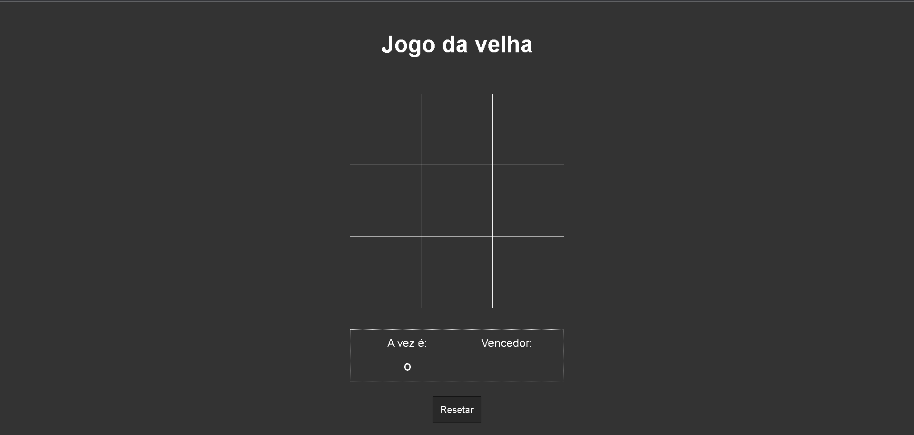

<h2 align="center"> 
  
</h2>

---
## Sobre
### **Projeto Jogo da Velha:**
 Bom, todo mundo conhece o jogo da velha, participam duas pessoas,  que jogam alternadamente, preenchendo cada um dos espaços vazios.  Cada  jogador poderá usar um símbolo (X ou O). Vence o participante que conseguir formar primeiro uma linha com três símbolos iguais, seja ela na horizontal, vertical ou diagonal.

 ---
GitHub Pages: https://aurelianoderafa.github.io/projeto-jogo-da-velha/

 ---
## 💻 Tecnologia utilizada
 * HTML 5 
 * CSS 3
 * JAVASCRIPT
